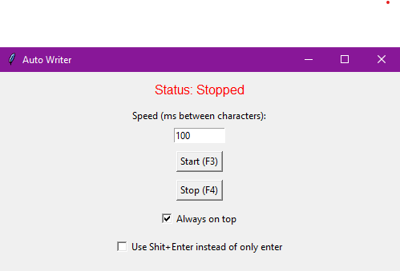

# Auto-Writer
Auto write whatever is on your clipboard



## 📦 Requirements That You Might Need (English)

- Python 3.10 or higher
- Operating System: Windows, Linux, or macOS
- Libraries:
  - pyautogui
  - keyboard
  - tkinter (already included with Python)
  - threading (built-in)
  - time (built-in)

Install dependencies with:

```bash
pip install pyautogui keyboard
```
## 📦 Requisitos Que Talvez Precise (Português)

- Python 3.10 ou Superior
- Sistema Operacional: Windows, Linux ou macOS
- Bibliotecas:
  - pyautogui
  - keyboard
  - tkinter (já vem com o Python)
  - threading (já incluso)
  - time (já incluso)

Instale as dependências com:

```bash
pip install pyautogui keyboard
```


